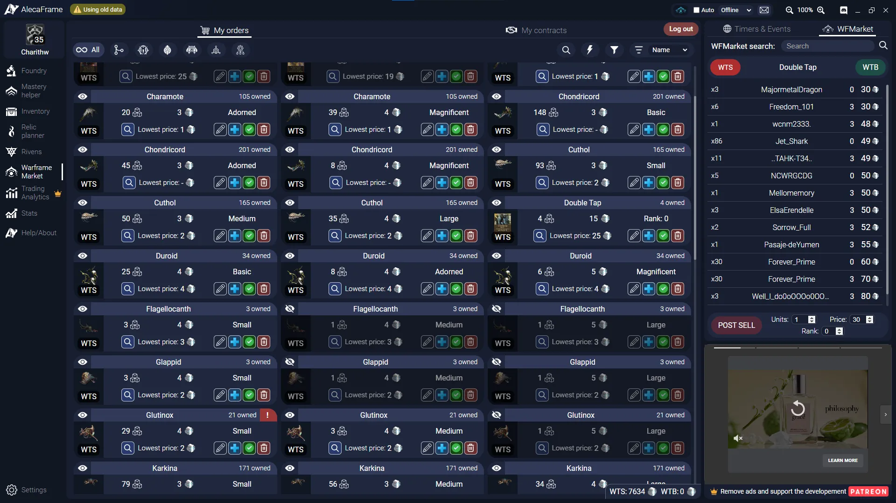

# AlecaFrame

Table of Contents

- [Inventory Management](#inventory-management)
- [Foundry & Mastery Helper](#foundry-mastery-helper)
- [Timers & Events](#timers-events)
- [Warframe.Market Integration](#warframemarket-integration)

## Overview

AlecaFrame is a companion app for Warframe that tracks player progression, inventory data, and more. It utilizes in-game information to provide things like tools for relic tracking and warframe.market integration. AlecaFrame is currently only for PC, but can provide huge benefits for players at any point in the game. AlecaFrame has many valuable features, but I'll touch on 4 major ones below.

Check out the website here to download AlecaFrame:
[https://alecaframe.com](https://alecaframe.com)

> **Disclaimer:** AlecaFrame operates in a grey zone of 3rd-party apps since Digital Extremes (DE) neither approves nor disapproves of 3rd-party apps. Historically apps that stay within Warframe's TOS remained unbanned, and Aleca currently does that. That said, people have blamed bans on AlecaFrame. Most have been reversed through DE support tickets, but please use Aleca at your own discretion. 

---
## Inventory Management

Aleca has an inventory management system for items and mods. The page has multiple filters and estimated pricing for any sellable items. 

> **Note:** Prices may be off by a margin. Check warframe.market for current listings or use the WTS/WTB buttons for a simplified live view of the WFM page.

<figure class="guide-text-image__img" style="flex: 0 0 30%;">
  
</figure>

---
## Foundry & Mastery Helper
Aleca also tracks your current arsenal of weapons and Warframes. Additionally, it provides a mastery tracker that shows what items you have missing and recommends items to master next.

  <figure>
    
  </figure>
  <figure>
    
  </figure>

---
## Timers & Events

On the right side of the display is the Timers & Events section. This contains a series of clocks and trackers that log:

- Day-Night Cycles
- Prime Resurgence
- Void Fissures
- Weekly and Daily Reset Timers
- The Circuit's Weekly Rotations

<figure class="guide-text-image__img" style="flex: 0 0 40%;">
  
</figure>

## Warframe.Market Integration

Aleca has built-in integration with warframe.market (WFM). As mentioned in our 
warframe.market guide, WFM is a great tool that facilitates easier trading between players.

Once you link your WFM account to AlecaFrame, you can manage your sale postings directly 
within Aleca. This includes tracking sales, adjusting prices, adding new listings, and setting 
your online status. This is especially useful when selling large quantities of items, as it 
removes the need to manage everything through the WFM website directly.

{ .center .floored width=70% }