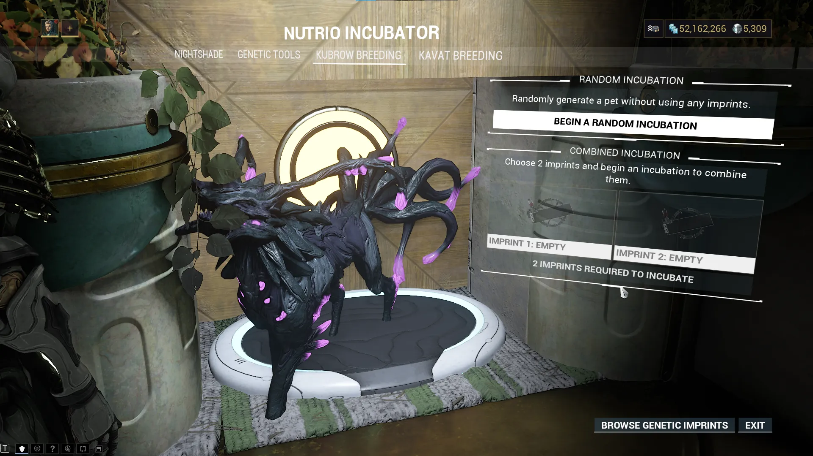
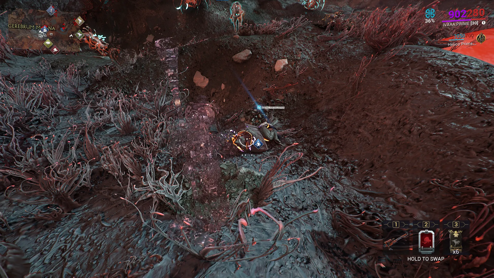

# Companions: Beasts

Table of Contents

- [Overview](#overview)
- [Breeding Basics](#breeding-basics)
- [Kubrows](#kubrows)
- [Kavats](#kavats)
- [Predasites](#predasites)
- [Vulpaphyla](#vulpaphyla)
- [Helminth Chargers](#helminth-chargers)

## Overview

Beast companions are animal companions that roam around the battlefield, providing support and assisting in combat. When a beast companion's health reaches zero, it will fall down and slowly recover. Revival can be sped up through mods or by manually reviving it like you would for a downed ally. Beasts also have access to unique and powerful beast-exclusive mods which are useful effects.

---
## Breeding Basics

Beasts have several inheritable traits that can be passed down to offspring through
genetic imprints:

- Pedigree - companion type
- Build - Normal, Slim, Bulky (Kubrows and Helminth Chargers only)
- Fur pattern & Body Type
- Fur Colors
- Eye Color
- Tail Patterns (Kavats only)
- Head type (Kavats only)
- Mutation (Predasites and Vulpaphyla only)

> **Note:** Height and gender are **not** inheritable traits. Any imprint seller charging a premium for "tall" pets is either misinformed or scamming.

To breed a companion, open the Incubator, and start an incubation. You can then choose between a random incubation or a combined incubation which uses two imprints to control what traits the companion will have. Breeding pets for profit is possible but is a lengthy and luck-based process, so I don't recommend exploring this until the late game.

{ .center .bordered .floored width=60% }

---
## Kubrows
Kubrows are your first beast companions, which you get access to with the Howl of the Kubrow quest.

### Getting a Kubrow

To incubate a Kubrow you'll need to find a Kubrow Egg and craft an Incubator Power Core. 

Kubrow Eggs can be found in Earth forest missions by destroying Feral Kubrow Dens and are picked up automatically when dropped. If you're destroying every den, you'll typically find an egg in 4 to 5 missions. Mantle, Earth is a great location since capture missions are relatively short, and you'll have plenty of time to explore. Alternatively, you can purchase eggs from the Market for 10 platinum.

Incubator Power Core blueprints can be bought in the market for credits, or the fully built item can be bought for 35 platinum.

Once you have both items, you can start incubating your Kubrow.

<figure class="guide-text-image__img" style="flex: 0 0 30%;">
  
</figure>

### Breeds

**Chesa**

Chesa are your 'looting' Kubrows. Neutralize disarms and Retrieve desecrates corpses for a chance at extra loot.

**Huras**

The stealth Kubrow. Stalk cloaks both the Kubrow and the player when enemies are nearby. Just like Shade's Ghost precept, Stalk's invisibility is broken by gunfire and melee attacks but not by warframe abilities. The Huras also has solid crit stats on its claws, making it a very capable damage dealer. 

**Raksa**

The Raksa is your guardian Kubrow. Protect allows it to restore large amounts of your Warframe's shields and pairs very well with Hildryn due to her high shields. Howl also provides the Raksa with an AOE slow.

**Sahasa**

The Sahasa is the utility Kubrow. Dig lets the Sahasa produce health, energy, and ammo drops. Dig can be inconsistent at times, but it's very nice when using energy heavy setups or archgun combat.

**Sunika**

The Sunika is your combat Kubrow. It has the highest base damage of any Kubrow claws and a hefty 3.5x crit multiplier. Savagery rushes up to 8 nearby enemies attacking each target and knocking them down. With Unleashed, the Sunika is also able to prioritize Eximi units and gains a damage bonus against their overguard. 

---
## Kavats
Kavats are the second type of beast companion. To get a Kavat, you need to first complete the Howl of the Kubrow quest and upgrade your incubator with the Kavat Incubator Upgrade Segment. The upgrade segment drops from Grineer Hyekka Masters and is found in the Tenno Labs of a clan's Dojo.

### Getting a Kavat
To incubate a Kavat, you'll need 10 Kavat Genetic Codes and an Incubator Power Core. 
Kavat Genetic Code can be farmed by scanning Feral Kavats in Deimos (except the Cambion Drift) or bought on the Market for 5 platinum each. Power Cores, as mentioned, above can be bought on the Market for credits (blueprint) or platinum (fully built).

A few tips for farming Genetic Codes:

- Bring a crowd control or sleep ability to avoid accidentally killing Feral Kavats
- Kavats can go invisible and will not appear on the map's radar. Use the Codex / Synthesis Scanner to spot them
- Farming in a group increases Feral Kavat pack size
- Drop chance boosters, drop boosters, resourceful retriever, Steel Path drop chance buff, and the Synthesis Scanner Cross-Matrix widget affect Kavat Genetic Code drops.
- The Inaros quest has one mission which spawns up to 50 Feral Kavats. If you haven't already done the quest its a great place to get genetic code.

Once you have 10 Genetic Codes, incubate them to receive either an Adarza or Smeeta Kavat.

### Breeds
**Adarza**

The Adarza is your crit-focused cat. Cat's Eye gives allies an absolute 60% crit chance. The Adarza has high crit damage stats on its claws, but compared to Kubrows, Kavats have much lower base damage. 

**Smeeta**

Smeeta is the premier affinity and focus farming Kavat. Every 27 seconds, Charm has a 40% chance to grant a buff to the player. These include:

- Crit chance set to 200% (guaranteed orange-tier crits)
- Infinite energy for 10 seconds
- 3x Affinity for 2 minutes
- Instantly reload once
- Negate next hit
- Generate one rare resource from the current planet

**Vasca**

The Vasca has a unique acquisition method. Take any Kavat to the Plains of Eidolon at night and have your Kavat be attacked and infected by a wild Vasca Kavat. Once infected, create an imprint of the Kavat to cure it and gain one Vasca imprint. Repeat this, and you can use your two Vasca imprints to incubate a Vasca.

The Vasca is your vampire Kavat. Draining Bite heals your Vasca, and Tranfusion lets it revive the player on a 2 minute cooldown. 

---
## Predasites
Predasites are infested beasts companions, similar to kubrows, that can be found roaming the Cambion Drift.

### Getting a Predasite
To get a Predasite you'll need to capture a weakened Predasite from the Cambion Drift and then ask Son to revive it. Wild Predasites that are attacked by the Infested will enter a weakened state, where they are capturable.

Once captured, bring it to Son in the Necralisk, along with one Antigen and one Mutagen to revive the Predasite and create your new companion. Blueprints for both of these can also be bought through Son.

{ .center .bordered .floored width=60% }

### Antigens & Mutagens
There are 4 options to pick from for both your Antigen and Mutagen:

**Antigen**

| Antigen | Polarity | Mutation |
|---------|----------|----------|
| Iranon | Vazarin | None |
| Elasmun | Madurai | Infestation through the horn |
| Ibexan | Naramon | Infestation through the jaw |
| Tethron | Penjaga | Infestation through the spine |

**Mutagen**

| Mutagen | Resistances | Mutation |
|---------|-------------|----------|
| Leptosam | Heat, Puncture | None |
| Chiten | Electricity, Slash | Rigid tail scales |
| Arioli | Cold, Impact | Infestation through the tail |
| Monachod | Toxin, Slash | Cartilage exoskeleton |

> **Note:** Imprints will carry both physical mutations and damage resistances, meaning Kubrow Egg incubations with two different Predasite imprints, will pass on the traits of both companions. A Predasite with all four Mutagen and Antigen traits is referred to as a '4x4' and there is a small market for people selling these imprints.

### Subspecies

**Vizier**

The common Predasite subspecies. Its precepts focus on corrosive crowd control and ally healing. Its claws deal Impact and Corrosive damage and have a high status chance.

**Medjay**

A rarer subspecies found primarily during Vome. The Medjay focuses on viral damage and setting up enemies for finishers. Its claws deal Slash and Viral damage and has good crit.

**Pharaoh**

The other rarer subspecies, found primarily during Fass. The Pharaoh focuses on buffing ally Toxin damage and shooting sticky viral grenades. Its claws deal Gas and Puncture damage and run the middle path, with balanced crit chance and status chance.

---
## Vulpaphyla
Vulpaphyla are infested fox-like beasts, similar to kavats, that can be found roaming the Cambion Drift.

### Getting a Vulpaphyla
The process for getting a Vulpaphyla is identical to the Predasite. Capture a weakened Vulpaphyla, bring it to Son in the Necralisk, and have one Antigen and Mutagen for revivification. 

### Antigens & Mutagens
There are 4 options to pick from for both your Antigen and Mutagen:

**Antigens**

| Antigen | Polarity | Mutation |
|---------|----------|----------|
| Desus | Vazarin | None |
| Virox | Madurai | Tumorous jaw growth |
| Plagen | Naramon | Scaled mane |
| Poxi | Penjaga | Shoulder protrusions |

**Mutagens**

| Mutagen | Resistances | Mutation |
|---------|-------------|----------|
| Adra | Heat, Puncture | None |
| Elsa | Electricity, Slash | Chitinous shell over tail |
| Zarim | Cold, Impact | Tentacle tail |
| Phijar | Toxin, Slash | Tail skin recedes |

> **Note:** Imprints will carry both physical mutations and damage resistances, meaning Kavat incubations with two different Vulpaphyla imprints, will pass on the traits of both companions. A Vulpaphyla with all four Mutagen and Antigen traits is referred to as a '4x4' and there is a small market for people selling these imprints.

### Subspecies

**Sly**

The common Vulpaphyla subspecies. Its precepts focus on creating decoys to draw aggro
and avoiding death through a larval state that reduces enemy accuracy while killing enemies.

**Crescent**

A rarer subspecies found primarily during Vome. The Crescent Vulpaphyla focuses on throwing enemies into the air, debuffing enemies with puncture procs, and avoiding death through a larval form that will attack enemies.

**Panzer**

The other rarer subspecies, found primarily during Fass. Its precepts focus on spreading viral spores similarly to Saryn's spores and avoiding death through a larval state that fires more viral projectiles at enemies while it self-revives.

---
## Helminth Chargers

The Helminth Charger is an Infested Kubrow created by combining the Helminth strain with a Kubrow egg. To obtain one, you'll need to get infected with the Helminth cyst and let it fully grow (7 days). Then begin a standard Kubrow incubation and when asked to put imprints, select the option to drain the cyst over the egg.  

It has two precepts which focus on pulling enemies, knocking them over, and gaining temporary buffs. 