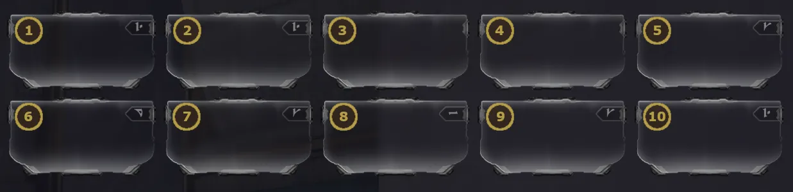

# Companions: Modding Guide

Table of Contents

- [Overview](#overview)
- [Modding Concepts](#modding-concepts)
- [Special Companion Mod Types](#special-companion-mod-types)
- [Synergies & Notable Combos](#synergies-notable-combos)

## Overview

This page covers a key modding concept for companions, unique companion mod groups, and some notable synergies.

---
## Modding Concepts

### Precept Priority

Companion precepts are unique mods that generally affect companion behavior and are identified by the Penjaga polarity, which looks like a vertical line and dot ( |• ). Companions prioritize using their precepts based on their order, with the top left slot being the highest priority and the bottom right slot being the lowest. Vacuum and Fetch are passive mods and are not affected by slot order, so they can be placed anywhere.

{ .center .bordered .floored width=60% }

### Link Mods

Link mods are a set of special mods that scale your companion's stats based on the player's Warframe or primary weapon's stats. So far there are 5 link mods, and they all only apply to free roaming companions. They are:

- **Link Vitality** - scales off player max health
- **Link Redirection** - scales off player max shields
- **Link Fiber** - scales off player armor
- **Hunter Synergy** - scales off primary weapon critical chance
- **Mecha Overdrive** - scales off primary weapon status chance

These mods depend entirely on your Warframe and weapon choice so their value really depends on having the right setup. For example, Link Redirection can allow for companions with less than 350 base shields to hit the 1200 max shield threshold for Reinforced Bond. Additionally, Hunter Synergy and Mecha Overdrive can provide massive damage boosts to beast companions, and pair particularly well with the Paris Incarnon which can grant roughly a final +300% bonus status chance and +50% bonus critical chance.

### My Modding Approach

My companion builds generally focus on maximizing their utility over their damage. This is not the only strategy but can be a good baseline if you don't know where to start.

Vacuum or Fetch will always go on every build. From there I like adding one defensive stat mod (health or if base shields > 350, then shields) and Momentous Bond for faster revival times. If there's left over mod slots at the end I may add a second defensive mod. 

If the companion can meet the thresholds for Reinforced Bond and Tenacious Bond, I always slot those in next. For me, free 60% fire rate and +1.2x final crit damage buffs are super valuable. Animal Instinct is another mod I really value since I like having a loot radar and larger enemy radar. My remaining slots will then go to Precepts, other Bond Mods, or utility mods like Synth Deconstruct to just increase what the companion can provide. 

For damage focused companions I will generally use Contagious Bond and build their weapons for max Heat damage and status chance to take full advantage of the mod. 

---
## Special Companion Mod Types

On top of common mods that you'll get from enemy drops, companions have access to several special mod groups. The following sections cover what these are and where to find them. 

### Bond Mods

Bond mods can be purchased from the conservation vendors in each open world hub for 20,000 standing after reaching rank 3 with the respective faction. Bond mods provide powerful effects, such as faster revival for pets, free ability casts, and semi-permanent stat buffs. Some of the strongest companion synergies are built around specific bond mods, so these are absolutely worth picking up regardless of which companion you decide to focus on.

### Claw Mods

Claw mods are exclusive to beast companions and cannot be farmed from enemies. While some claw mods can be farmed naturally, most must instead be obtained by trading animal tags to the respective conservation vendor of each open world hub. These fall into two categories. 

**Posture mods** affect companion targeting behavior and grant bonus mod capacity like aura and melee stance mods. 

**Regular claw mods** boost claw damage or add additional effects, such as Bell Ringer, which causes your companion to knock down enemies or Burning Claws, which converts all your companion's elemental damage into Heat damage.

### Retriever Mods

Retriever mods are beast companion **exclusive** mods that give a chance to double credit pickups, resources drops, or both. This makes beast companions ideal for targeted credit/resource farming. Like claw mods, you'll need to trade animal tags with specific conservation vendors:

| Mod | Vendor | Effect |
|-----|--------|--------|
| Loyal Retriever | Master Teasonai (Cetus) | 13% chance to 2x resource & credit pickups |
| Prosperous Retriever | The Business (Fortuna) | 18% chance to 2x credit pickups |
| Resourceful Retriever | Son (Necralisk) | 18% chance to 2x resource pickups |

---
## Synergies & Notable Combos

This section covers some personal cool mod combinations and synergies that I think are worth knowing about. This list is not exhaustive but should make you aware of some of the more impactful combos. 

- **Reinforced Bond & 350 Base Shields**

    Reinforced bond gives a +60% fire rate buff as long as your companion has over 1200 shields. If your companion has a max shield value over 1200, then this becomes a permanent buff (while the companion is alive). This can be achieved with Calculated Redirection on any companion with 350 or more base shields. Additionally beast companions paired with Link Redirection and a high shield frame can also meet this threshold. 

&nbsp;

- **Tenacious Bond**

    Tenacious Bond grants a 1.2x crit damage buff when your companion's crit chance is over 50%. All beast companions can comfortably hit this threshold with Bite. For Sentinels, only a few weapons can reach this without a Riven, including the Burst Laser Prime and Laser Rifle Prime. 

&nbsp;

- **Momentous Bond**

    Momentous Bond is near mandatory on most companions builds and effectively replaces the need for a Regen mod on Sentinels. Each Eximus kill reduces your companion's recovery timer by 18 seconds. It also grants your companion additional elemental damage types, which synergizes very well with Manifold Bond and Condition Overload-like effects. 

&nbsp;

- **Synth Deconstruct & Equilibrium**

    This combination is a very reliable energy generation method. Synth Deconstruct causes enemies damaged by your companions to drop health orbs, and Equilibrium on your Warframe will convert those orbs into energy. This really shines in high density missions, where you can maintain a high kill rate and produce lots of health orbs.

&nbsp;

- **Manifold Bond & High Cooldown Precepts**

    Manifold bond is a mod that allows Robotic companions' (Sentinels, Hounds, & MOAs) damaging abilities to apply statuses based on all damage types on their weapon. Additionally, when you or your companion kill an enemy with 3 or more status effects on them, it will reduce your companions cooldowns by 3 seconds. This synergizes really well with high impact, high cooldown precepts like Guardian which restores shields or Cordon which groups enemies. Give your companion a weapon that can easily prime enemies and you can create a quick looping effect. 

&nbsp;

- **Mystic Bond**

    Mystic Bond generates a free ability cast after your companion uses a precept ability 5 times. Precepts that trigger rapidly, like Diriga's Arc Coil, can generate free ability casts at a high rate. This can be further scaled through Manifold Bond's cooldown reduction, which will allow precepts to trigger more frequently.

&nbsp;

- **Contagious Bond & Heat**

    Contagious Bond causes enemies killed by your companion to spread half of their statuses to nearby enemies, and this effect can chain between enemies, leading to damage numbers in the millions or billions with the right setup. Heat is the ideal element for this combo since Heat procs refresh with each new stack applied. Any companion weapon with high status chance and consistent damage output, like the Verglas, can really abuse this. 

&nbsp;

- **Martyr Symbiosis**

    Martyr Symbiosis is a Vulpaphyla exclusive mod, that lets your companion sacrifice itself to heal you when you drop below 10% health. Pairing this with Momentous Bond can rapidly reduce the recovery timer minimizing the downside of having your pet die.