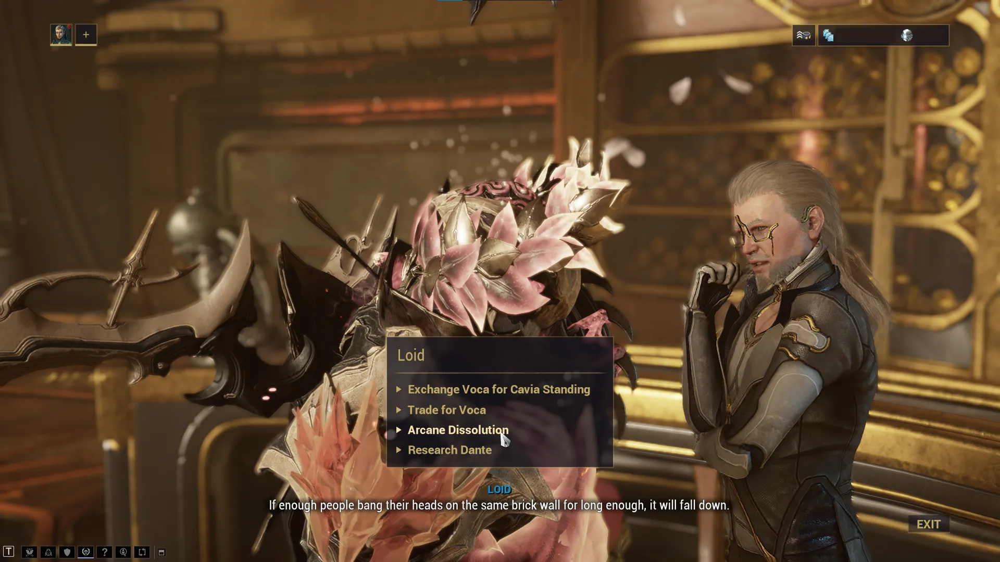

# Arcane Dissolution

Table of Contents

- [Overview](#overview)
- [Farming Vosfor](#farming-vosfor)
- [Dissolution Recommendations](#dissolution-recommendations)
- [Arcane Pack Recommendations](#arcane-pack-recommendations)

## Overview

Arcane Dissolution is a system that lets you convert unwanted arcanes into other potentially desirable ones. This guide breaks down how the system works along with some tips and recommendations.

> **Note:** This guide briefly mentions events that may spoil parts of the game. Please don't read further unless you have completed the Whispers in the Walls quest or don't care about spoilers. 

Arcane Dissolution is unlocked after completing the Whispers in the Walls quest and accessing the Sanctum Anatomica. To use it, talk to the human Loid in the Sanctum hub and select the "Arcane Dissolution" option.

{ .center .bordered .floored width=60% }

From here, you can dissolve arcanes into an alchemical powder called Vosfor. Select "Dissolve Arcanes" in the bottom right of the screen to open your arcane inventory and choose which arcanes to dissolve. Each arcane yields different amounts of Vosfor. For example, each copy of Arcane Grace dissolves into 98 Vosfor, while each Primary Merciless arcane dissolves into 20 Vosfor. 

That Vosfor can then be spent on arcane packs, each costing 200 Vosfor and 50,000 credits. Each pack contains 3 random arcanes from its drop pool, with drops weighted by rarity.

---
## Farming Vosfor

If you don't have arcanes to dissolve or would rather not, there are other ways to farm Vosfor:

1. Elite Deep Archimedea awards Vosfor at the 28 point tier (20 Vosfor) and 37 point tier (50 Vosfor)
2. Höllvania Faceoff missions can award varying amounts of Vosfor
3. 200 Vosfor packs can be bought from the [6 Faction Syndicates](faction-syndicates.md) for 30,000 standing
4. Kaya sells a 200 Vosfor pack for 6 Pix Chips, earned through Temporal Archimedea

---
## Dissolution Recommendations

Generally, I recommend dissolving duplicate arcanes that sell for low prices or don't sell easily. I've put together a personal dissolution chart covering Vosfor values, platinum prices, and recommendations for each arcane

> **Note:** Please read the disclaimers in the sheet before using it.

[Arcane Dissolution Chart](https://docs.google.com/spreadsheets/d/1wTDfjnZD6iojyDfDibBc5HWyo5X43iLVyVUW7yz0NT4/edit?usp=sharing)

---
## Arcane Pack Recommendations

I recommend first spending your Vosfor to earn arcanes you're missing and don't want to farm for. On the flip side, avoid packs that contain easily farmable arcanes or arcanes from content you already run regularly. The Holdfasts Pack and Steel Path Pack generally fall into this category.

For a pure profit approach, Duviri packs are currently the most profitable. Other packs like Höllvania packs can have high value pulls (Example: Arcane Hot Shot sells for 500 plat at the time of making this guide), but the average pull value is not that high. 
