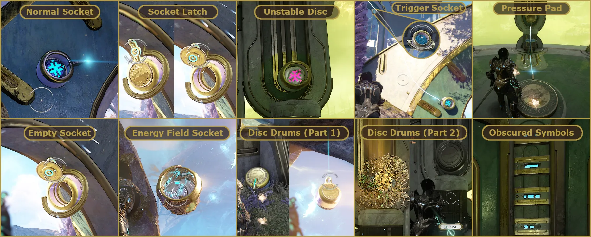
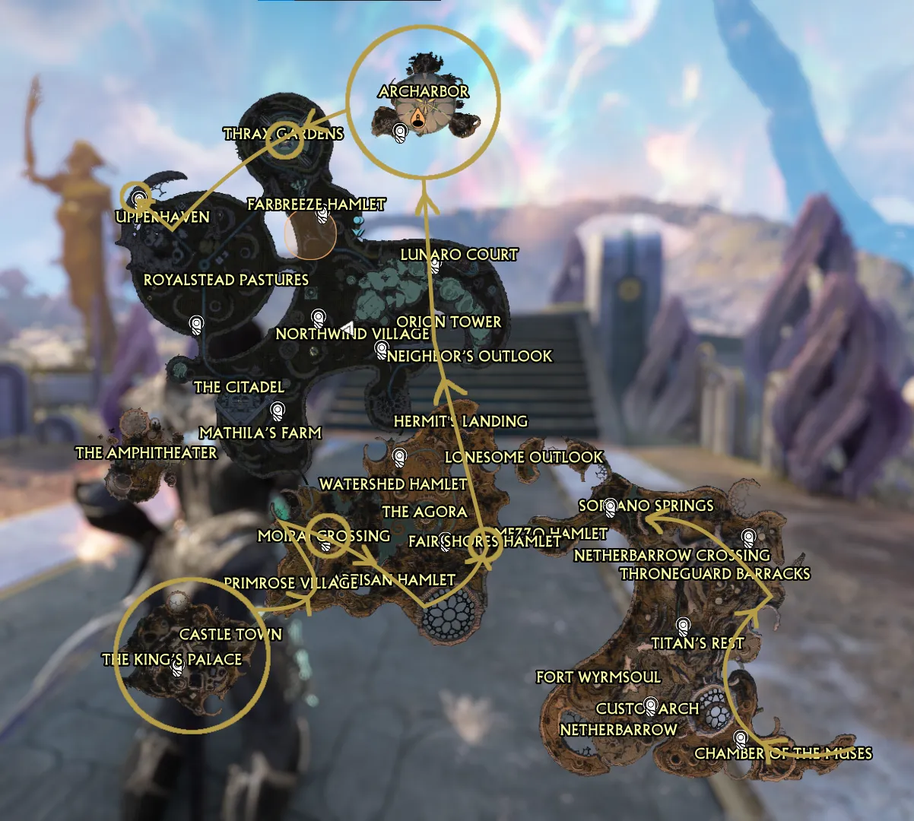
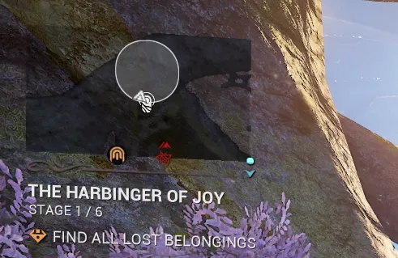
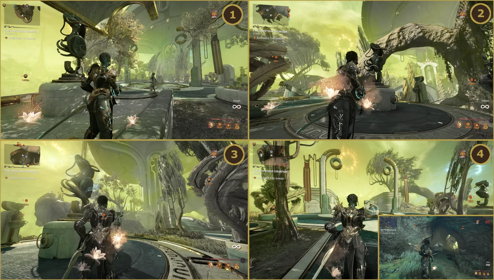
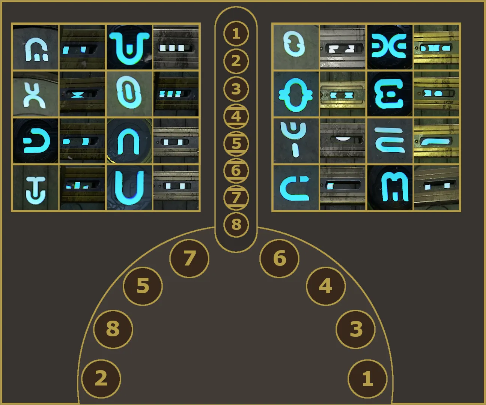

# Duviri Enigmas

## Overview

Duviri Enigma puzzles are random mini puzzles that populate Duviri and focus around unlocking a Paragrimm Hutch.

Completing the puzzle rewards the player with a collection of Duviri resources, enigma gyrum, and potentially blueprints for the Cinta, a bow with the hitbox the size of a small bus.

These puzzles are fundamentally not that difficult, but a bit of knowledge can make farming enigma gyrum and Cinta parts **significantly** easier.

In this guide I'll cover the two types of puzzles you'll see (random & Archarbor), how you find them, and tips for solving them.

---

## Randomized Puzzles

When you enter Duviri a set number of enigma puzzles will spawn. If you play solo you will only see single-player puzzles, if you play in a group you will also have multi-player puzzles that spawn as well.

As mentioned in the overview, each puzzle centers around a Paragrimm Hutch (as seen in the picture). At its core, you are matching the 3 sockets hidden around the puzzle with the 3 symbols on the Hutch. After solving the puzzle, if you want to abort the mission without completing the Duviri Experience, you'll need to earn one additional decree to 'save' the resources collected.

> **Note:** Multiplayer puzzles will have the Hutch initially closed, and will require two players to interact with the side panels of the Hutch to open it.

<figure class="guide-text-image__img">
  
</figure>

There are many variations to these puzzles, including:

- Standard sockets
- Latches that require you to shoot the target to open
- Unstable discs that shoot lasers back at you
- Pressure pads or trigger sockets, which require activation to open other sockets
- Some sockets may be empty and require you to find a disc to throw into the socket
- If there's an energy field over the disc, it will remember the symbol. This is **very important** because you may end up with limited discs. Match these symbols first
- Free standing discs can be found in the world in multiple ways (hanging from archways, entangled in plants, hidden in fully sealed drums/sockets that need to be broken or pushed)
- Some symbols on the Hutch may also be damaged or obscured by bars. You have to brute force those and/or recognize the symbol hidden underneath

{ .center }

---

## How to Find Randomized Puzzles

While Paragrimm Hutches spawn randomly, there are fixed locations that they can spawn. What I typically do is fly across Duviri and cover the high density areas for spawns. 

{ .center .bordered width=60% }

Previously, your only way to find them was to keep an eye out for the floating sockets which are typical of Enigma puzzles, or for a white circle to appear on the map. Recently however, DE has introduced the Enigma Sense. This is a permanent upgrade you can get from Acrithis in your Dormizone, and will mark any Paragrimm Hutches within 150m of your Drifter with an enigma gyrum emblem. You'll still have to fly around and search for them, but it does make it easier to find.

> **Note:** Puzzle spawns can be really rough. If you're just doing this for the Nightwave mission, I recommend rushing Archarbor instead of searching for the randomized puzzles. It's quick to run and oftentimes I find a puzzle on the Archarbor island as well.

Additionally, the white circle also indicates the area where all the discs & sockets can be found. This is useful since it limits the area you have to search.

{ .center .bordered }

---

## Archarbors

The other main type of Enigma puzzle you'll find is the Archarbor, which spawns in the top of the map and only spawns during Joy, Sorrow, and Envy spirals. It's a more complex puzzle but gives additional Enigma Gyrum, more resources, and a higher Cinta drop chance compared to running solo puzzles.

The puzzle sits at the bottom of the Archarbor island and requires you to align 4 statues around the island to unlock the gates protecting it (see map and statue pictures below).

<figure class="guide-text-image__img" style="flex: 0 0 30%;">
  
</figure>

With each statue, you can use your interact key to 'push' the statue, rotating it. You want to align them facing the center of the island:

- **Statue 1** - 2 pushes
- **Statue 2** - 3 pushes
- **Statue 3** - 1 push
- **Statue 4** - Hack the console by statue 1 and the floor panels will open up. Go all the way down and activate the final statue. 
> **Note:** This statue will **not** activate until **all** 3 previous statues are facing the center of the island

{ .center .bordered width=80% }

Once all 4 statues are activated/aligned, the gates underneath the island will retract! This is where the Archarbor puzzle spawns!

> **Note:** If you rush it too fast, sometimes the puzzle won't spawn. Either reset or just go back to the mainland, earn a decree and come back to fix it

<figure class="guide-text-image__img" style="flex: 0 0 40%;">
  
</figure>

Once at the bottom, you'll see 8 sockets and 8 symbols (4 obscured) to match. Thankfully each symbol matches to a specific socket and MOST symbols have unique obscured views, so you can refer to the chart below for an easy guide to the Archarbor puzzle itself.

4 discs are on the opposite side of the room from the 8 symbols. I recommend working on the standard sockets and sockets with energy plates first. Once you're done, then popping the discs off the energy sockets to work on the remaining sockets.

> **Remember!:** Once solved, you'll need to earn one more decree before leaving to 'save' all your loot!

{ .center width=80% }