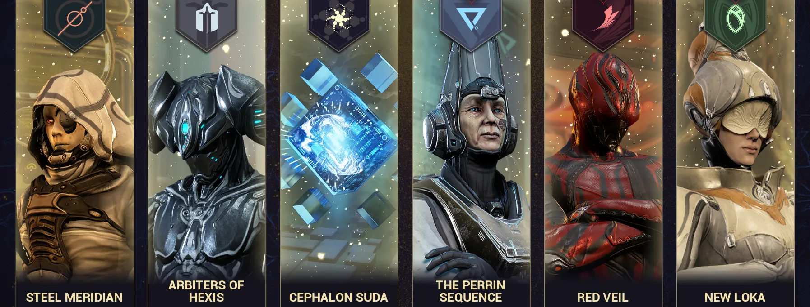
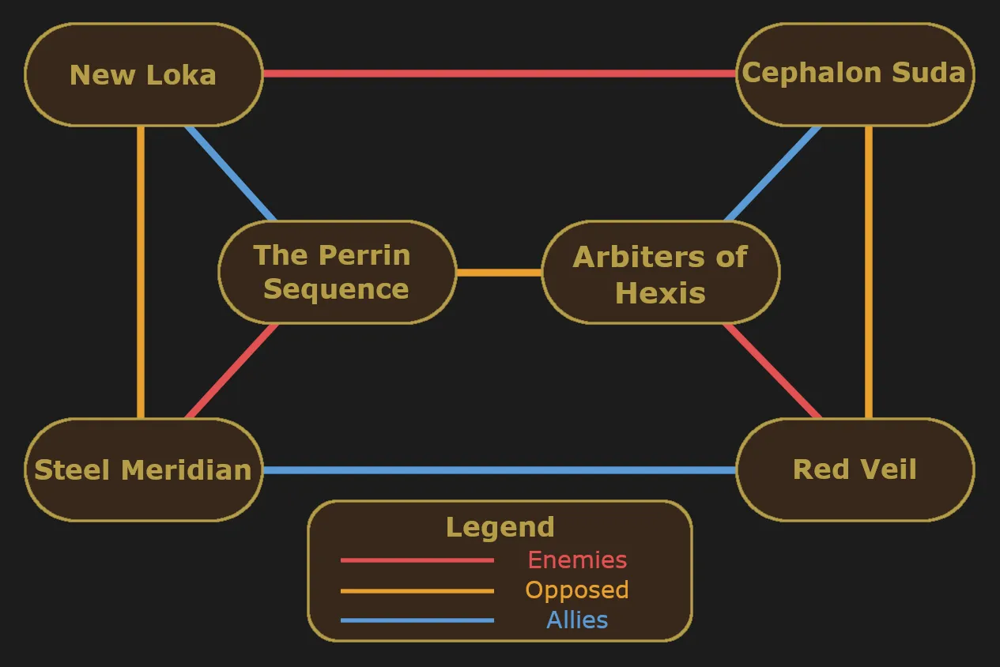

# Faction Syndicates: The Big Six

Table of Contents

- [Overview](#overview)
- [How Syndicates Work](#how-syndicates-work)
- [Picking your Syndicate](#picking-your-syndicate)
- [Syndicate Rewards](#syndicate-rewards)
- [Syndicate Missions](#syndicate-missions)

## Overview

Faction syndicates are 6 rivaling factions in Warframe, each with their own unique values and agendas. Unlike neutral syndicates such as the Ostrons or Solaris United, you cannot ally with all 6 Faction syndicates simultaneously. Allying with one faction will put you at odds with others, so you'll need to make deliberate choices about who you pledge to. 

> **Note:** It's *technically* possible to maintain standing with all 6 through VERY extensive and complicated micromanagement, but this isn't practical in the slightest.

{ .center .bordered .floored width=90% }

---
## How Syndicates Work

At Mastery Rank 3, you can access the Faction syndicates through the console to the left of the navigation terminal in your Orbiter. From there, you will be asked to pledge to one of the 6 factions. Each faction will provide a brief statement and a list of their relations with the other factions. 

For example, Cephalon Suda is allied with the Arbiters of Hexis and enemies with New Loka. Gaining standing with Cephalon Suda will alwo earn you standing with the Arbiters of Hexis. However, it will also passively drain your standing with New Loka. A chart detailing all their relations can be found below.

> **Note:** Once you pledge, you will passively gain a percentage of your affinity earned as standing for your active syndicate. 

{ .center .bordered .floored width=60% }

---
## Picking your Syndicate

The short answer is that there's no 'wrong' first choice. You can ally with the faction based on their beliefs, appearance, rewards, or any other reason you like.

For a very brief and comedic summary of each faction:

| Syndicate | Summary |
|-----------|---------|
| Steel Meridian | The Rebel Alliance |
| Arbiters of Hexis | Warframe Stans & Sword Weebs |
| Cephalon Suda | ChatGPT |
| Red Veil | Murder Hobos |
| Perrin Sequence | Capitalism but 'not' Evil |
| New Loka | Eco-terrorists |

As you progress, you can ally with additional factions to gain access to their sets of rewards. Without micromanagement, most people will ally with either 2 or 3 syndicates. With some standing management tricks you can also ally with a 4th syndicate but can be tedious to manage. The two groups of 3 syndicates you'll see people align with are:

1. Cephalon Suda, Arbiters of Hexis, and Steel Meridian
2. New Loka, The Perrin Sequence, and Red Veil

These groupings coincidentally align with the order on the pledge screen, which is why players sometimes refer to the groups as the Left Side and Right Side syndicates.

> **Note:** I recommend starting with either Suda + Hexis or Loka + Perrin and picking up the third (Red Veil or Meridian) when you feel ready. Starting with Red Veil and Steel Meridian can make you enemies with the remaining 4 syndicates, which can be resource-intensive to recover from.

---
## Syndicate Rewards

At this point you may be wondering, "This seems like a lot of effort. What do I get out of it?"

PERSONAL SATISFACTION

Just kidding!

At each syndicate rank you unlock more rewards. Some highlights for each rank include:

- **Rank 0** - Faction sigils
- **Rank 1** - Specters
- **Rank 2** - Syndicate Void Relic packs and Archwing weapon components
- **Rank 3** - Squad Restores (Large) blueprint and more Archwing weapon components
- **Rank 4** - Weapon augment mods
- **Rank 5** - Warframe augment mods, weapons, fashion accessories, captura scenes, and honoria

Each Faction syndicate has its own unique rewards, so its beneficial to ally with multiple syndicates. The one exception to this is Warframe augment mods, which are each found in two of the 6 syndicates. If there is something you want from a syndicate you're not allied with, you can always trade for it with other players. 

---
## Syndicate Missions

Once you reach Rank 1 with a syndicate, they'll start offering syndicate missions, accessible through the syndicate tab in the top right corner of the navigation screen. These missions grant extra syndicate standing that bypasses the daily standing cap. In most missions, you can find up to 8 syndicate medallions scattered across the map.

> **Note**: Interception and Defense syndicate missions may spawn fewer medallions or none at all depending on the tileset.

Medallions are spawned randomly around the mission and come in three tiers. While they may not be easy to spot, they do show up as item drops on the minimap.

| Tier | Standing |
|------|----------|
| Common | 500 |
| Uncommon | 1,000 |
| Rare | 5,000 |

In a standard syndicate mission with 8 medallions, there will **always** be one rare medallion and a minimum of 2 uncommon medallions. Medallions can be turned in at your Syndicate's vendor in the relay for standing which bypasses the daily cap. 

<figure class="guide-text-image__img" style="flex: 0 0 35%;">
  
</figure>

> **Note**: Stockpiling medallions for relic packs is a great way to get new Void relics after a Prime release