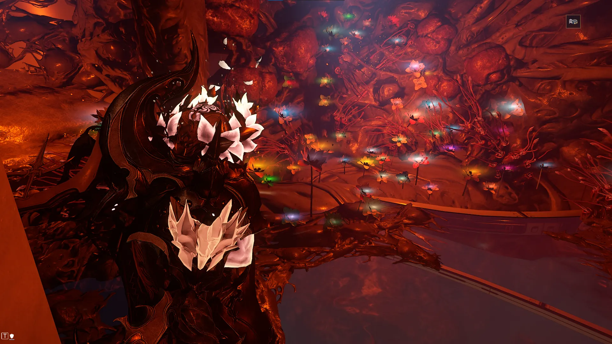
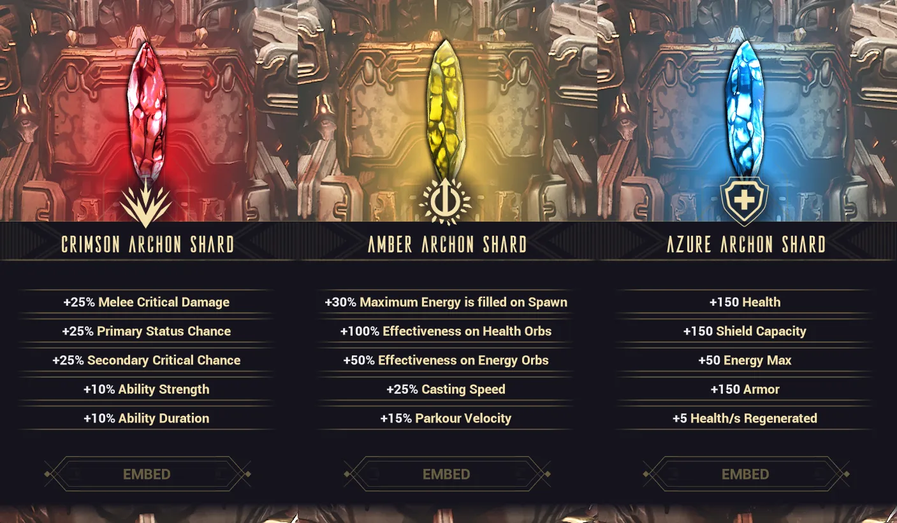
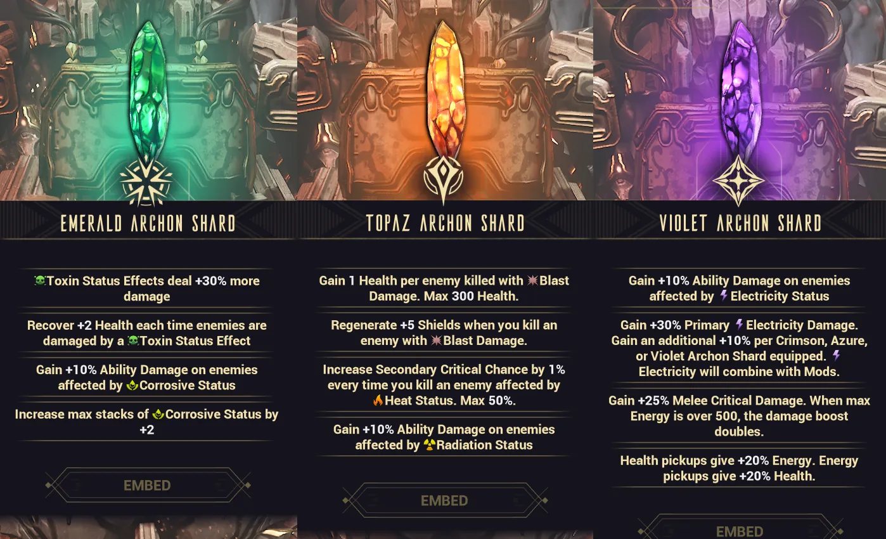

# Helminth System Guide

Table of Contents

- [Overview](#overview)
- [Unlocking the Helminth](#unlocking-the-helminth)
- [Feeding Your Helminth](#feeding-your-helminth)
- [Feature: Subsuming](#feature-subsuming)
- [Ranking Up Helminth](#ranking-up-helminth)
- [Feature: Invigoration](#feature-invigoration)
- [Archon Shard Management](#archon-shard-management)

## Overview 

Helminth is a being that resides in the infirmary of the Orbiter and is responsible for the ship's biological functions, repairs, and Warframe maintenance. While the Helminth technically encompasses the whole room and its infestation, it does have a large mouth in the back of the infirmary that functions as the "main body".

The helminth has three major features:

1. Subsuming Warframe abilities
2. Invigorating Warframes with temporary buffs
3. Managing Archon Shards

To interact with these features, you'll simply need to sit in the infested chair in the center of the room.

---
## Unlocking the Helminth
### Temporary Access & The Helminth Cyst

At first, the infirmary will be locked. To temporarily gain access, you'll need either Nidus or a Warframe infected with a Helminth cyst. These cysts can be obtained by coming into contact with other infected players and take 7 days to fully grow. A fully grown cyst will allow you to open the infirmary door to remove the cyst and innoculate your Warframe. Once a Warframe has been innoculated, it cannot regain a cyst. 

<figure class="guide-text-image__img" style="flex: 0 0 15%;">
  
</figure>

### Full Access
To permanently unlock the Helminth and the infirmary, you'll need to purchase and craft the Helminth Segment from Son in the Necralisk. It requires 15,000 standing, Rank 3 (Associate) with the Entrati Family, and Mastery Rank 8. Alternatively, you can purchase it as part of the Helminth Segments Bundle for 300p on the market. Once crafted, install the segment by sitting on the infirmary infested chair. At this point you will get to name your Helminth.

---
## Feeding Your Helminth

The Helminth is quite hungry and will need food (resources) to convert to Secretions for its special functions. To feed it, sit in the chair, click the "FEED \<Helminth Name\>" in the bottom right corner. *Mine is named Adephagia, after the Greek goddess of Gluttony*

This opens a resource page, as seen below, that displays the Helminth's 6 food groups: Oxides, Calx, Biotics, Synthetics, Pheromones, and Bile.

The Helminth also desires diversity. Feeding the same resource in a short period of time will increasingly reduce its effectiveness. Helminth's interest in a resource is shown by a green triangle (interested) or a red triangle (disinterested). Given enough time, Helminth will start to desire resources again, but this can take up to 24 hours to fully restore interest. 

These resource costs can add up quite a lot in the mid game, so I've listed a few resources that I recommend using and saving. As a general rule of thumb, if you can easily farm the resource or have a lot of it, then it should be safe to feed it to Helminth.

<figure class="guide-text-image__img" style="flex: 0 0 40%;">
  
</figure>

**Oxides**

- Feed: Salvage, Ferrite, and Railjack resources
- Avoid: Tellurium

**Calx**

- Feed: Rubedo, Grokdrul, Iradite, and Railjack resources
- Avoid: Hexenon (needed in large amounts for several Warframes and weapons)

**Biotics**

- Feed: Whichever plants you have lots of (I use Ganglion, Maprico, and Nistlepods)
- Avoid: Duviri plants (required in large amounts for several mid and late game weapons)

**Synthetics**

- Feed: Detonite Ampules, Fieldron Samples, and Control Modules
- Avoid: Orokin Cells and Neural Sensors

**Pheromones**

- Feed: Nano Spores, and Juggernaut parts (Husk, Bile Sac, Tubercles, Palpators)
- Avoid: Plastids and Neurodes

**Bile**

- Feed: Argon Crystals, Nav Coordinates, Voidgel Orbs, Orokin Ciphers, and Ticor Plate
- Avoid: Everything else in low quantities. This category has limited options so feed efficiently.

---
## Feature: Subsuming

Non-Prime Warframes can be fed to Helminth which will digest the frame over 23 hours and permanently learn that frame's subsume ability. These abilities can then be injected into other Warframes, replacing one of their existing abilties. This can make up for a frame's weaknesses, add fun effects, or just add a lot of extra damage.

To infuse an ability onto your Warframe, simply select the subsume, choose which ability to replace, and choose which configs should be affected. Each config page can only have 1 subsumed ability, but you can use multiple subsumes across different config slots to allow for build variety.

> **Note:** You cannot have a subsumed ability replace different abilities across config slots. For example, I cannot have the Roar subsume replace Nidus's 4th ability in Config A and his 3rd ability in Config B. 

Additionally, Helminth will grow a flower for each Warframe consumed. The flower will inherit its colors from your Warframe's fashion at the time it was subsumed. Over time you will end up with a flower graveyard documenting the frames you've fed to the flesh wall.

{ .center .bordered .floored width=70% }

---
## Ranking Up Helminth

As you feed Helminth, subsume Warframes, and infuse abilities, your Helminth system will gain experience and gain Metamorphosis Ranks, unlocking more subsume slots and Helminth exclusive subsumes.

Early on, you'll hit a bottleneck that limits the number of Warframes you can subsume. At Rank 10, you'll get unlimited subsume slots and this bottleneck will disappear. Before that you'll need to focus on injecting abilities, feeding helminth, or injecting invigorations to raise your rank. Experience
is gained through the following activities:

| Activity | Experience Gained |
|----------|------------------|
| Subsuming a Warframe | 1,600 xp |
| Injecting an ability | 8 xp per 1% of material used |
| Feeding the Helminth | ~6.66 xp per 1% of material gained |
| Injecting an Invigoration | 4,800 xp |

---
## Feature: Invigoration

The second feature of Helminth is to invigorate Warframes, giving them randomized buffs lasting one real-world week. To unlock this feature, you'll need to craft the Helminth Invigoration Segment from Son in the Necralisk. The blueprint for this segment requires 30,000 standing, Rank 5 (Family) with the Entrati Family, and Mastery Rank 8. Additionally, just like the Helminth Segment you can buy it as part of the Helminth Segments Bundle for 300p.

Each week, your Helminth will offer 3 randomized invigoration buffs for 3 random Warframes. Each invigoration grants 1 offensive buff and 1 utility buff. 

After 10 invigorations, you'll gain the ability to apply your next invigoration to any frame without restriction. After doing so, this feature will reset.

<figure class="guide-text-image__img" style="flex: 0 0 30%;">
  
</figure>

---
## Archon Shard Management

The third feature of the Helminth system is Archon Shard management. Archon Shards are stat shards that can be embedded into Warframes to grant passive bonuses. Shards are considered semi-consumable since they cannot be shared but can be removed (for a cost) and reused. Each Warframe can hold up to 5 Archon Shards. 

To access this system you'll need the Helminth Archon Shard Segment whose blueprint is given after completing the Veilbreaker.

### Primary Shards

Shards come in 2 forms: regular and Tauforged. Tauforged shards are stronger variants with a 50% increase in stats. There are 3 primary shard types, each offering several stat options to pick from.

{ .center .bordered .floored width=60% }

### Secondary Shards & Fusions

Additionally, after reaching Rank 2 with the Cavia, you can purchase the Helminth Coalescent Segment blueprint from Bird 3 for 30,000 Cavia standing. Crafting this segment unlocks two functions:

- **Coalescent Fusion** - Fuse two primary shards together to create a secondary shard
- **Ascent Fusion** - Fuse 3 regular shards of the same type to create a Tauforged version. 

Just like primary shards, there are 3 secondary shards that have their own unique stat options to pick from.

{ .center .bordered .floored width=60% }

### Obtaining Archon Shards

Archon shards can be earned from many weekly methods including:

- **Weekly Archon Hunt**
    - Rewards 1 primary regular or Tauforged shard on completion
- **Bird 3**
    - Requires Rank 5 Cavia
    - Rewards 1 primary regular shard for 30,000 Cavia standing
- **Weekly SP Descendia**
    - Can potentially reward one primary shard as the final reward
- **Weekly 1999 Calendar**
    - Can randomly offer a primary or secondary shard as a reward

The following methods can also give Archon Shards but share a pool of 5 charges per week:

- **Netracells**
    - Drains 1 charge on completion
    - 0-1 primary regular or Tauforged shard on completion
- **Deep Archimedea and Elite Deep Archimedea (DA & EDA)**
    - Requires Rank 5 Cavia
    - Costs 2 charges to unlock, and can be run repeatedly to improve scores and gain missed rewards
    - Rewards 0-5 primary regular or Tauforged shards based on the highest challenge score and drop rates. Matching challenge options = more points = more rewards
- **Temporal Archimedea and Elite Temporal Archimedea (TA & ETA)**
    - Requires Rank 5 Hex
    - Costs 2 charges to unlock, and can be run repeatedly to improve scores and gain missed rewards
    - Rewards 0-5 primary or secondary regular or Tauforged shards based on the highest challenge score and drop rates. Matching challenge options = more points = more rewards