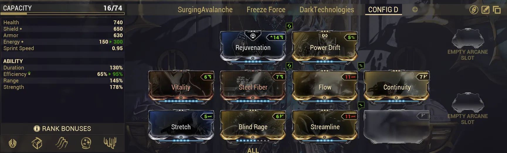

# Modding: A Checklist for Warframes

Table of Contents

- [Overview](#overview)
- [The Checklist](#the-checklist)
- [1. What Do All the Abilities Do?](#1-what-do-all-the-abilities-do)
- [2. What's My Playstyle?](#2-whats-my-playstyle)
- [3. How Do I Survive?](#3-how-do-i-survive)
- [4. What Stats Should I Mod?](#4-what-stats-should-i-mod)
- [5. What QoL Would Be Good?](#5-what-qol-would-be-good)
- [Putting It All Together](#putting-it-all-together)
- [Example: Basic Frost Build](#example-basic-frost-build)
- [Example: SP Frost Build](#example-sp-frost-build)

## Overview

This guide walks through my personal checklist for building Warframes from scratch and is based on lessons and tips I've picked up through my time playing Warframe. The goal of this guide, along with my other checklists, is to give you a repeatable thought process that you can apply to any moddable item in Warframe. Builds created this way may not be 'perfect', but they will be functional and can serve as a great starting point for refining your final builds. Even if you decide to always follow build guides, this thought process will be helpful for evaluating guides and understanding how they function. 

My Warframe checklist has 5 questions to help plan your build, and at the end I've included regular and Steel Path Frost builds to show the process.

---
## The Checklist

1. What Do All the Abilities Do?
2. What Style of Play Do I Want?
3. How Do I Survive?
4. What Stats Do I Want?
5. What QoL Would Be Good?

---
## 1. What Do All the Abilities Do?

The first step is simply to read over all of your Warframe's abilities. Get a general idea of what each ability does and how they might synergize with each other. For example, abilities that buff melee critical chance, grant invisibility, or allow for flight will drastically change how a Warframe functions and how you might want to play it.

---
## 2. What's My Playstyle?

Most Warframes have multiple build archetypes so the second step is to figure out how you want to play the frame. 

Most builds fall into three general archetypes:

- **Weapon Platforms** - Builds that focus purely on buffing your weapons and letting your guns or melee do the damage (e.g. Roar Rhino builds)
- **Casters** - Builds that focus on abilities or exalted weapons as your primary damage source (e.g. Grasp of Lohk Xaku)
- **Hybrid / Utility** - Builds that provide utility or flexibility where you don't specialize into either of the above (e.g. Despoil Desecrate Nekros)

For example, here are my weapon platform and caster summoner Volt builds side by side. Each functions very differently and as such are modded quite differently. 

  <figure>
    
  </figure>
  <figure>
    
  </figure>

---
## 3. How Do I Survive?

> **Note:** This section goes into a lot more detail than the rest of the guide because it covers a lot of info about defensive layers. Don't worry if everything doesn't click immediately. The goal is to just give you an idea of how defenses work in Warframe and how you want to mod for these. 

One of the core concepts of Warframe is that you need to stay alive to do anything. As such, the third step is to figure out how you'd like to do that based on your Warframe's stats, its abilities, and your chosen playstyle. A good rule of thumb is to aim for 2-3 synergistic effects, such as pairing health tanking with armor and damage reduction mods.

Below are some of the defensive 'layers' you can consider for your builds

### Health Tanking

Health tanking is one of your basic defensive layers and works well on frames with decent base health and armor values or abilities that can generate either of these stats. Generally you'll want 2-3 of the following:

- Health mod (e.g. Vitality)
- Armor mod (e.g. Steel Fiber)
- Health regen or restore (e.g. Rejuvenation or Arcane Grace)

Health tanking does have its limitations at very high levels where enemy damage can eventually kill you in one hit.

> **Note:** Arcane Persistence is a late game Arcane that makes health tanking viable at higher levels by removing the limitation mentioned above. With it equipped, if your armor is over 700, you cannot take more than 500 damage per second.

### Shield Tanking

If a frame has poor health or armor, shield tanking and shield gating are your main alternatives. Shields function differently to health and have a built-in 50% damage reduction. When your shields are fully drained, you also gain a brief period of invincibility called a 'Shield Gate'. This gate negates any overflow damage that you would have taken and its duration scales based on the amount of shield you had recharged since your last shield gate. This is what allows some builds to survive enormous amounts of damage in the late game. There are multiple forms of shield tanking which I'll cover below.

&nbsp;

**Basic Shield Tanking**

This is your early game shield defensive layer. It will allow you to take some hits and will recharge quickly when you're not taking damage. Slot a shield mod and a shield recharge rate mod and you'll be good. However, at higher levels, this won't be sufficient and instead you'll want to focus on some form of shield gating. 

&nbsp;

**Shield Gating (Shield on Energy Spent)**

Shield gating is a strategy which involves quickly regenerating shields after your shield gate invincibility period to set yourself up for another shield gate when you next take damage. One method of doing that is with Brief Respite or Augur mods, which restore shields based on your energy spent. This works particularly well with one easily recastable ability and some good method of energy restoration. Do note that efficiency will hurt builds that use exclusively Brief Respite or Augur mods since it will reduce your energy spent per ability and thus reduce the shields you restore on cast.

&nbsp;

**Shield Gating (Catalyzing Shields)**

Catalyzing Shields is another mod that augments shield gating. It lowers your total shields by 80% but grants a 1.33 second shield gate if your shields fully recharge before being broken again. You can pair this with either Brief Respite and Augur mods or with recharge mods (mentioned next) to help restore shields quickly.

> **Note:** Catalyzing Shields has been bugged since release and currently grants the 1.33 second shield gate with **any** amount of shields restored, making it much stronger and easier to use

&nbsp;

**Shield Gating (Recharge Rate)**

Mods and arcanes like Fast Deflection and Arcane Aegis can lower your shield recharge delay, which is the time it takes for your shields to recharge after taking damage. These can be run alone in lower level content or paired with Catalyzing Shields as an additional layer for mid to late game builds. Arcane Aegis is included here because it has an undisclosed effect that removes all shield recharge delay while active, so due to how shield gating works, it will effectively give you 12 seconds of invincibility (except for Toxin damage).

### Damage Reduction (DR)

Some frames have abilities that grant percentage damage reduction (DR), such as Nova's Null Star or Mirage's Eclipse. Outside of frame abilities, Adaptation is the main way to get DR. It synergizes really well with basic health and shield tanking, but generally will fall off at higher levels where players start to swap to shield gating and Arcane Persistence builds.

### Invisibility

Some frames can turn invisible with abilities and pure ability caster builds can also make use of Shade's Ghost or the Huras Kubrow's Stalk precepts for semi-permanent invisibility. Invisibility is a strong defensive option but has two important caveats. Firstly, gunfire will still alert enemies who will fire at your general location. Using silencer mods like Hush or staying mobile can fix this. Second, in parties you may still be hit by stray shots. 

### Overguard

Overguard is a special defensive stat that grants immunity to statuses and crowd control. It does not benefit from **any** form of damage reduction, but it does provide a 0.5 second period of invincibility when broken. Some frames and arcanes can generate Overguard consistently, potentially making this a reliable defensive layer. 

### Invincibility

True invincibility is the holy grail of defensive options. However, outside of a few frames like Revenant and Oberon, frames looking to get conditional invincibility on their builds can use the Rolling Guard mod, which cleanses status effects and grants 3 seconds of invincibility on roll and which goes on a 7 second cooldown afterwards.

---
## 4. What Stats Should I Mod?

After deciding on a build style and defensive options, the fourth step is to figure out what stats to focus on. To do this, you'll need to pick 1 or 2 abilities that you want to focus on. For a weapon platform build this could be your buffing and debuffing abilities. For a caster build this would be your core damage abilities. Once you've picked your abilities, take a look at what aspects of the ability scale with what stats.

For example, Rhino's Roar scales with Strength, Range, and Duration. For a solo weapon platform build, you can skip range and focus on Strength and Duration to get a very strong lengthy buff.

> **Note:** Some abilities have augment mods that can greatly change how the ability works or add much needed QoL. It's good to start looking into these at this point in the checklist.

---
## 5. What QoL Would Be Good?

Quality of Life (QoL) mods improve how smoothly a build functions instead of focusing on defenses or damage. Common examples include mods for energy management, casting speed, parkour velocity, and knockdown resistance. Most builds have room for 1-2 QoL mods and they're often worth the slots for the added comfort.

---
## Putting It All Together

With the checklist covered and some ideas in your head about your build, here's how I'd start modding:

1. Aura mod - pick based on polarities, what you have, or what best fits your build goals
2. Build defining features - augments, subsumes or anything that's needed for your desired playstyle
3. Defensive layers - as mentioned, at least 2-3 layers
4. Stat mods - Focus on stats to boost your core abilities
5. QoL mods - Slot em in based on need and comfort. Want more comfort? Add more QoL mods

---
## Example: Basic Frost Build

So Frost is one of my favorite frames and is obtainable relatively early on (from Vor & Lech Kril on Exta, Ceres). His kit is pretty straightforward to build around and this basic build is geared towards base star chart with no augments, prime mods, arcanes, or subsumes. Furthermore, only Nightwave-earnable Aura mods are used. 

**1. What Do All the Abilities Do?**

Frost's kit revolves around cold effects and crowd control. His abilities focus on locking down areas and debuffing enemies.

**2. What's My Playstyle?**

For a basic build, I'm running Frost as a support caster with all his crowd control and letting my weapons do the damage.

**3. How Do I Survive?**

Health tanking. Frost has solid base armor and gets even more from his passive. I'll add a health mod and an armor mod at first. Adaptation can replace the armor mod later on since the passive gives so much armor.

**4. What Stats Should I Mod?**

With a support build, I'm mainly going to focus on Frost's Avalanche, which scales with Strength, Duration, and Range. These are the stats I'll invest in.

**5. What QoL Would Be Good?**

Frost has a low energy max and his abilities are expensive. For QoL mods, Flow and Streamline solve both of these issues.

{ .center .bordered .floored width=80% }

---
## Example: SP Frost Build

This is my general Steel Path Frost build. It uses augments, a subsume, and arcanes, and I'll assume you're familiar with those systems. Do note, this build isn't the 'ultimate' Frost build. It's my SP build which is geared towards comfortably clearing Steel Path missions.

**1. What Do All the Abilities Do?**

Same as the basic build, but I'm also adding the Biting Frost augment and subsuming Breach Surge.

**2. What's My Playstyle?**

Hybrid. Biting Frost's crit chance and crit damage buff helps buff Frost's weapons, and Breach surge can inherit this effect allowing Breach Surge sparks to red crit dealing potentially massive amounts of damage.

**3. How Do I Survive?**

Tanking with Overguard via the Icy Avalanche augment and pairing this with standard shield tanking and Snow Globe to protect myself during the window when my Overguard is down. 

**4. What Stats Should I Mod?**

Its the same as the basic build, but investing more in Range and Strength for Avalanche and Breach Surge. Higher values will give more coverage and armor strip enemies fully.

**5. What QoL Would Be Good?**

Mod slots are much more limited in this build. I've offloaded casting speed and energy management to Archon Shards to free up mod slots. *What isn't shown here is Synth Deconstruct on my companions to synergize with the 2 Violet Archon Shards (Equilibrium Shards)*

  <figure style="flex: 0 0 56.5%">
    
  </figure>
  <figure>
    
  </figure>

