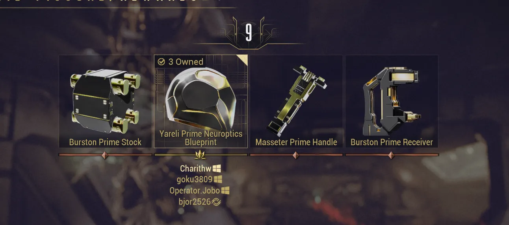

# Void Relics Explained

Table of Contents

- [Overview](#overview)
- [Opening Relics](#opening-relics)
- [Relic Rewards and Refinement](#relic-rewards-and-refinement)
- [Cracking Relics Efficiently](#cracking-relics-efficiently)
- [Farming Relics](#farming-relics)

## Overview

Void Relics are special items that contain Prime parts and other valuable rewards. They come in four tiers: Lith, Meso, Neo, and Axi, each tied to an era of the Orokin Empire and a fissure mission type. Each relic has unique rewards which you can check using the Void Relic terminal in your Orbiter.

---
## Opening Relics

To open a relic, take it into a Void Fissure mission of the matching tier/era and collect 10 reactant from enemies. Once you have enough reactant, your relic will be cracked open. You'll be able to collect your reward at the end of the mission for standard missions, or at each reward interval for endless missions. A list of all Void Fissures can be found at any time in the Void Fissures tab of your navigation screen.

> **Note:** When cracking relics with a party, you will be able to choose your reward from any of the relics cracked by other party members. 

{ .center .bordered .floored width=70% }

---
## Relic Rewards and Refinement

Relic rewards are divided into three tiers:

- **Common** (Bronze)
- **Uncommon** (Silver)
- **Rare** (Gold)

Relics can additionally be refined using Void Traces to increase the chance for uncommon and rare drops. The refinement tiers for relics can be found below:

| Quality | Traces | Common | Uncommon | Rare |
|---------|--------|--------|----------|------|
| Intact | 0 | 76% (25.33%) | 22% (11%) | 2% |
| Exceptional | 25 | 70% (23.33%) | 26% (13%) | 4% |
| Flawless | 50 | 60% (20%) | 34% (17%) | 6% |
| Radiant | 100 | 50% (16.67%) | 40% (20%) | 10% |

*The percentages in parentheses represent the per-item drop chance*

<figure class="guide-text-image__img" style="flex: 0 0 30%;">
  
</figure>

---
## Cracking Relics Efficiently

Always try to crack relics in public lobbies or 4 man groups. Since you can choose your reward from anyone's cracked relic, more players means more options to pick from. For uncommon and rare parts, the go-to method is a **"Rad Share"**: a group where all four players run the same relic at Radiant refinement. This gives the best chance for uncommon and rare rewards. To host one, post in recruit chat using this format:

`H [Relic Name] Rad X/4` for example `H [Lith A3 Relic] Rad 2/4`

A variant of this is the **"Rad Stagger"**, where the group runs four missions in a row and players take turns running their desired relic while everyone else runs common relics. This method lets you maximize the drops from a single relic, making it good for limited relics or Prime Resurgence relics. That said, it requires a high level of trust between players since it is easy to scam and leave early. Stick to friends or trusted clanmates for this one.

For mission type, captures and exterminates fissures are generally the fastest. Endless missions like defense, survival, and disruption are slower but offer scaling benefits, making them worth it for long farming sessions. At the end of the day, pick the fissure type you enjoy most. Optimizing the fun out of the game rarely ends well.

---
## Farming Relics

As mentioned, relics are grouped into 4 eras. Outside of a few exceptions, if a mission drops a relic of a specific era, it has an equal chance of dropping any relic from that era. 

*e.g Hepit has a 93.38% chance to drop a lith relic (13.34% chance for each of the current 7 lith relics) and a 6.67% chance for Aya*

Below are my recommended locations for farming relics of each era.

> **Note:** These methods only work for unvaulted relics. For farming Prime Resurgence relics, please refer to the [Primes, Vaulting, & Resurgence](prime-vault.md) guide.

### Recommended Locations

| Era | Node | Mission Type | Relic Drop Chance |
|-----|------|--------------|-------------------|
| Lith | Hepit, Void | Capture | 93.38% |
| Meso | Ukko, Void | Capture | 50% (43.75% Neo) |
| Meso | Olympus, Mars | Disruption | 100% R3+ ¹ |
| Neo | Ukko, Void | Capture | 43.75% (50% Meso) |
| Neo | Ur, Uranus | Disruption | 94.92% R3+ ² |
| Axi | Apollo, Lua | Disruption | 86.94% R3+ ² |

*¹ Assumes all conduits defended. Rounds 1-2 drop Lith relics*

*² Assumes all conduits defended. Rounds 1-2 drop the previous era's relics.*

### Other Sources

Relic Packs can be purchased with standing from Faction and Open World syndicates or with Steel Essence from Teshin, and contain 3 items which can be relics or Aya.

Elite Sanctuary Onslaught (ESO) awards one Radiant-refined relic every 2 waves, with the era varying by rotation:

| Rotation | Waves | Drop Chance |
|----------|-------|-------------|
| A | 2, 4, 10, 12... | 79.7% Lith / Meso |
| B | 6, 14... | 63.9% Meso / Neo |
| C | 8, 16... | 74.8% Neo / Axi |